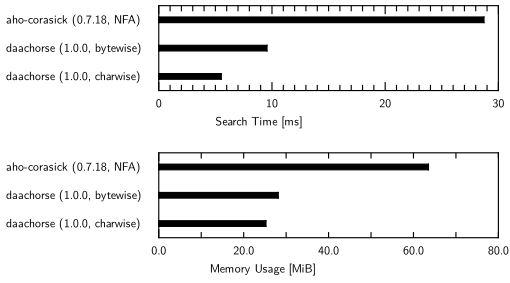

# 🐎 daachorse: Double-Array Aho-Corasick

A fast implementation of the Aho-Corasick algorithm using the compact double-array data structure.

[](https://crates.io/crates/daachorse)
[](https://docs.rs/daachorse)


## Overview

Daachorse is a crate for fast multiple pattern matching using
the [Aho-Corasick algorithm](https://dl.acm.org/doi/10.1145/360825.360855),
running in linear time over the length of the input text.
For time- and memory-efficiency, the pattern match automaton is implemented using
the [compact double-array data structure](https://doi.org/10.1016/j.ipm.2006.04.004).
The data structure not only supports constant-time state-to-state traversal,
but also represents each state in a compact space of only 12 bytes.

For example, compared to the NFA of the [aho-corasick](https://github.com/BurntSushi/aho-corasick) crate
that is the most poplar Aho-Corasick implementation in Rust,
Daachorse can perform pattern matching **3.1 times faster**
while consuming **45% smaller** memory, when using a word dictionary of 675K patterns.
Other experimental results can be found in
[Wiki](https://github.com/legalforce-research/daachorse/wiki).



## Installation

To use `daachorse`, depend on it in your Cargo manifest:

```toml
# Cargo.toml

[dependencies]
daachorse = "0.3"
```

## Example usage

Daachorse contains some search options,
ranging from basic matching with the Aho-Corasick algorithm to trickier matching.
All of them will run very fast based on the double-array data structure and
can be easily plugged into your application as shown below.

### Finding overlapped occurrences

To search for all occurrences of registered patterns
that allow for positional overlap in the input text,
use `find_overlapping_iter()`. When you use `new()` for constraction,
unique identifiers are assigned to each pattern in the input order.
The match result has the byte positions of the occurrence and its identifier.

```rust
use daachorse::DoubleArrayAhoCorasick;

let patterns = vec!["bcd", "ab", "a"];
let pma = DoubleArrayAhoCorasick::new(patterns).unwrap();

let mut it = pma.find_overlapping_iter("abcd");

let m = it.next().unwrap();
assert_eq!((0, 1, 2), (m.start(), m.end(), m.value()));

let m = it.next().unwrap();
assert_eq!((0, 2, 1), (m.start(), m.end(), m.value()));

let m = it.next().unwrap();
assert_eq!((1, 4, 0), (m.start(), m.end(), m.value()));

assert_eq!(None, it.next());
```

### Finding non-overlapped occurrences with shortest matching

If you do not want to allow positional overlap, use `find_iter()` instead.
It reports the first pattern found in each iteration,
which is the shortest pattern starting from each search position.

```rust
use daachorse::DoubleArrayAhoCorasick;

let patterns = vec!["bcd", "ab", "a"];
let pma = DoubleArrayAhoCorasick::new(patterns).unwrap();

let mut it = pma.find_iter("abcd");

let m = it.next().unwrap();
assert_eq!((0, 1, 2), (m.start(), m.end(), m.value()));

let m = it.next().unwrap();
assert_eq!((1, 4, 0), (m.start(), m.end(), m.value()));

assert_eq!(None, it.next());
```

### Finding non-overlapped occurrences with longest matching

If you want to search for the longest pattern without positional overlap in each iteration,
use `leftmost_find_iter()` with specifying `MatchKind::LeftmostLongest` in the construction.

```rust
use daachorse::{DoubleArrayAhoCorasickBuilder, MatchKind};

let patterns = vec!["ab", "a", "abcd"];
let pma = DoubleArrayAhoCorasickBuilder::new()
          .match_kind(MatchKind::LeftmostLongest)
          .build(&patterns)
          .unwrap();

let mut it = pma.leftmost_find_iter("abcd");

let m = it.next().unwrap();
assert_eq!((0, 4, 2), (m.start(), m.end(), m.value()));

assert_eq!(None, it.next());
```

### Finding non-overlapped occurrences with leftmost-first matching

If you want to find the the earliest registered pattern
among ones starting from the search position,
use `leftmost_find_iter()` with specifying `MatchKind::LeftmostFirst`.

This is so-called *the leftmost first match*, a bit tricky search option that is also
supported in the [aho-corasick](https://github.com/BurntSushi/aho-corasick) crate.
For example, in the following code,
`ab` is reported because it is the earliest registered one.

```rust
use daachorse::{DoubleArrayAhoCorasickBuilder, MatchKind};

let patterns = vec!["ab", "a", "abcd"];
let pma = DoubleArrayAhoCorasickBuilder::new()
          .match_kind(MatchKind::LeftmostFirst)
          .build(&patterns)
          .unwrap();

let mut it = pma.leftmost_find_iter("abcd");

let m = it.next().unwrap();
assert_eq!((0, 2, 0), (m.start(), m.end(), m.value()));

assert_eq!(None, it.next());
```

### Associating arbitrary values with patterns

To build the automaton from pairs of a pattern and integer value instead of assigning
identifiers automatically, use `with_values()`.

```rust
use daachorse::DoubleArrayAhoCorasick;

let patvals = vec![("bcd", 0), ("ab", 10), ("a", 20)];
let pma = DoubleArrayAhoCorasick::with_values(patvals).unwrap();

let mut it = pma.find_overlapping_iter("abcd");

let m = it.next().unwrap();
assert_eq!((0, 1, 20), (m.start(), m.end(), m.value()));

let m = it.next().unwrap();
assert_eq!((0, 2, 10), (m.start(), m.end(), m.value()));

let m = it.next().unwrap();
assert_eq!((1, 4, 0), (m.start(), m.end(), m.value()));

assert_eq!(None, it.next());
```

## CLI

This repository contains a command line interface named `daacfind` for searching patterns in text files.

```
% cat ./pat.txt
fn
const fn
pub fn
unsafe fn
% find . -name "*.rs" | xargs cargo run --release -p daacfind -- --color=auto -nf ./pat.txt
...
...
./src/errors.rs:67:    fn fmt(&self, f: &mut fmt::Formatter) -> fmt::Result {
./src/errors.rs:81:    fn fmt(&self, f: &mut fmt::Formatter) -> fmt::Result {
./src/lib.rs:115:    fn default() -> Self {
./src/lib.rs:126:    pub fn base(&self) -> Option<u32> {
./src/lib.rs:131:    pub const fn check(&self) -> u8 {
./src/lib.rs:136:    pub const fn fail(&self) -> u32 {
...
...
```

## Disclaimer

This software is developed by LegalForce, Inc.,
but not an officially supported LegalForce product.

## License

Licensed under either of

 * Apache License, Version 2.0
   ([LICENSE-APACHE](LICENSE-APACHE) or http://www.apache.org/licenses/LICENSE-2.0)
 * MIT license
   ([LICENSE-MIT](LICENSE-MIT) or http://opensource.org/licenses/MIT)

at your option.

## Contribution

Unless you explicitly state otherwise, any contribution intentionally submitted
for inclusion in the work by you, as defined in the Apache-2.0 license, shall be
dual licensed as above, without any additional terms or conditions.
